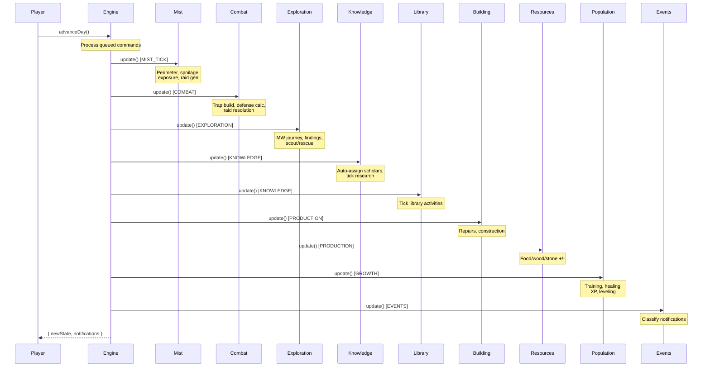
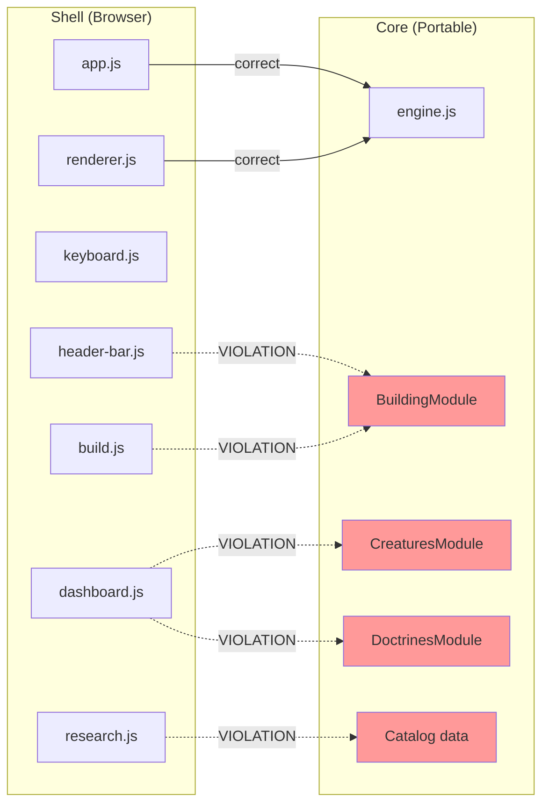

# Mistwalker — Architectural Analysis
<!-- Generated v0.05s — 2026-02-18 -->

---

## 1. MODULE INVENTORY

### Core Engine (5 files)

| File | Lines | Primary Responsibility |
|------|-------|----------------------|
| `src/core/engine.js` | ~580 | Orchestrates the 10-phase day cycle, dispatches commands to module handlers, owns the master game loop. |
| `src/core/state.js` | ~324 | Factory function `createInitialState()` that generates the full initial state with 20 procedurally-generated characters. |
| `src/core/config.js` | ~99 | Single source of truth for all balance values — training durations, resource rates, combat multipliers, scaling curves. |
| `src/core/commands.js` | ~223 | Defines 31 command types and validates each against current state before execution. |
| `src/core/rng.js` | ~64 | Seeded LCG pseudo-random number generator providing `random()`, `randInt()`, `pick()`, `weightedPick()`, `chance()`. |

### Core Modules (13 files in `src/core/modules/`)

| File | Lines | Primary Responsibility |
|------|-------|----------------------|
| `time.js` | ~64 | Manages the 10-phase state machine and day counter. |
| `population.js` | ~176 | Character training, healing, XP, leveling, role assignment with default tasks. |
| `mist.js` | ~309 | Perimeter stability calculation, gap consequences (spoilage, exposure, lost), raid generation and escalation. |
| `combat.js` | ~354 | Raid resolution (5 outcome tiers), defense calculation, trap building/placement, structure damage. |
| `exploration.js` | ~500+ | MW state machine (home→traveling→exploring→returning), findings table, scouting, rescue, expeditions. |
| `knowledge.js` | ~273 | Scholar auto-assignment to clues, research progress ticking, completion resolution. |
| `library.js` | ~400+ | Book catalog, browse/scavenge/study flow, language prerequisites, ability unlocking, category XP. |
| `creatures.js` | ~300+ | World creature generation (5 types, 21 traits), compendium tracking, power/strength formulas. |
| `doctrines.js` | ~300+ | Counter map (20 traits → 40 counters), combat selection management, doctrine test recording. |
| `building.js` | ~400+ | Structure construction/repair queue, tower priest auto-assignment, trap production, recipe availability. |
| `resources.js` | ~92 | Worker production (food/wood/stone), consumption (1 food/person/day), starvation check. |
| `events.js` | ~181 | Notification classification (routine/notable/critical/mythic), event feed building (500 cap). |
| `underground.js` | ~60 | Digging progress, room discovery, tome generation. **DISABLED — not called in advanceDay().** |

### Core Data (3 files in `src/core/`)

| File | Primary Responsibility |
|------|----------------------|
| `library-catalog.js` | 30+ book definitions with tiers, languages, abilities, role benefits. |
| `counter-catalog.js` | Ability-granting books that unlock combat counters. |
| `filler-catalog.js` | Filler books for library padding. |

### Shell — UI Layer (6 files in `src/shell/`)

| File | Lines | Primary Responsibility |
|------|-------|----------------------|
| `app.js` | ~76 | Bootstrap: creates engine, renderer, keyboard manager, wires the game loop. |
| `renderer.js` | ~728 | Tab routing, render orchestration, command dispatch bridge between UI and engine. |
| `keyboard.js` | ~471 | Full keyboard navigation: Tab/Home cycling, arrow nav, Enter activation, Shift+Enter advance day. |
| `lexicon.js` | ~106 | Display-name lookup tables for roles, assignments, stats, tabs, health states. |
| `notifications.js` | ~69 | Notification overlay handler — receives feed entries, manages display. |
| `audio.js` | ~42 | Web Audio API sound effects (click). |

### Shell — Components (4 files in `src/shell/components/`)

| File | Lines | Primary Responsibility |
|------|-------|----------------------|
| `header-bar.js` | ~293 | Top resource bar, version display, perimeter gauge, defense summary. |
| `modal.js` | ~248 | Character sheet modal (stats, training, health, abilities). |
| `feed.js` | ~93 | Chronicle sidebar with classified event entries. |
| `overlay.js` | ~111 | Full-screen overlay for mythic events. |
| `collapsible.js` | ~59 | Collapsible section headers with expand/collapse toggle. |

### Shell — Tabs (7 files in `src/shell/tabs/`)

| File | Lines | Primary Responsibility |
|------|-------|----------------------|
| `dashboard.js` | ~948 | Day overview, quick actions (induct, send MW, join wardline), raid combat panel with doctrine/priest selection UI. |
| `people.js` | ~249 | Full population roster grouped by role, assignment display, health states. |
| `explore.js` | ~751 | MW journey status, scouting queue, expedition party builder, raid incoming list. |
| `research.js` | ~1582 | Scriptorium sub-tab (clue queue, reorderable) + Library sub-tab (scholar workspace, book study, language learning). |
| `build.js` | ~400+ | Engineer corps roster with activity detail, structure build queue, trap production with Cancel/progress UI. |
| `items.js` | ~200+ | Artifact inventory (equip/unequip to characters), tome usage. |
| `compendium.js` | ~200+ | Creature bestiary with progressive trait reveal, doctrine test history. |

### Supporting Files

| File | Primary Responsibility |
|------|----------------------|
| `index.html` | Entry point, cache-busted module imports, no-cache meta tags. |
| `styles.css` | All visual presentation (dark fantasy theme, gold accents, responsive layout). |
| `server.py` | Local dev server (Python, port 8000). |
| `src/data/names.json` | 100+ fantasy character name pool. |
| `src/data/locations.json` | Ring 1 locations (3 vital with 3 tiers each, 5 minor). |
| `src/data/raids.json` | Raid flavor text templates. |
| `src/data/artifacts.json` | 6 artifact templates with stat bonuses. |

---

## 2. STATE OWNERSHIP

### Per-Module State Ownership

Each module's `update()` function is called during a specific day phase. Below: what state each module **writes to** during its phase, and what **shared state** it reads from other modules.

| Module | Phase | Owns (writes) | Reads from other modules |
|--------|-------|---------------|-------------------------|
| **time.js** | (orchestrator) | `time.day`, `time.phase`, `time.gamePhase` | — |
| **mist.js** | MIST_TICK | `mist.*` (clock, perimeterStability, raidQueue, natures, nextRaidDay, raidCount) | `population.characters`, `exploration.mwState`, `buildings.structures`, `buildings.towerPins`, `creatures.types` |
| **combat.js** | COMBAT | `combat.*` (defenseRating, trapBuildProgress, trapInventory, trapPlacementQueue, traps, activeRaids, combatLog) | `population.characters`, `exploration.mwState`, `creatures.types`, `buildings.structures` |
| **exploration.js** | EXPLORATION | `exploration.*` (mwState, locations, activeExpedition, completedExpeditions) | `population.characters`, `mist.raidQueue`, `time.day` |
| **knowledge.js** | KNOWLEDGE | `knowledge.*` (clues, activeResearch, completed, sourceClues, mapFragments) | `population.characters`, `library.scholarStates` |
| **library.js** | KNOWLEDGE | `library.*` (librarianId, scholarStates, unlockedAbilities) | `population.characters` |
| **building.js** | PRODUCTION | `buildings.*` (structures, buildQueue, repairQueue, unlockedTypes) | `population.characters`, `resources`, `time.day` |
| **resources.js** | PRODUCTION | `resources.food`, `resources.wood`, `resources.stone` | `population.characters` |
| **population.js** | GROWTH | `population.characters[]` (training, role, assignment, health, xp, stats) | `config.training`, `config.leveling`, `config.health` |
| **events.js** | EVENTS | `events.feed[]` | All notifications (read-only) |
| **creatures.js** | (init only) | `creatures.types[]`, `creatures.compendium{}` | — |
| **doctrines.js** | (command-time) | `combat.pendingSelections`, `combat.confirmedDoctrines`, `combat.doctrineTests` | `library.unlockedAbilities`, `population.characters` |
| **underground.js** | DISABLED | `underground.*` | `population.characters`, `resources` |

### Cross-Module State Mutation (during update phases)

These modules write to state owned by OTHER modules during their update phase:

| Module | Foreign State Written | Why |
|--------|----------------------|-----|
| **mist.js** | `combat.activeRaids` | Promotes incoming raids to active when arrival day reached |
| **mist.js** | `population.characters[].health` | Mist exposure injuries |
| **mist.js** | `resources.food` | Spoilage from perimeter gap |
| **combat.js** | `population.characters[].health` | Combat injuries/deaths |
| **combat.js** | `resources.food` | Food loss on defeat/catastrophic |
| **combat.js** | `buildings.structures[].hp` | Raid damage to structures |
| **combat.js** | `buildings.repairQueue` | Queues repairs for damaged structures |
| **combat.js** | `resources.wood` | Trap building consumes wood |
| **exploration.js** | `knowledge.clues`, `knowledge.artifacts` | MW findings feed research pipeline |
| **exploration.js** | `resources.herbs`, `resources.essences` | MW herb/essence finds |
| **exploration.js** | `creatures.compendium` | MW creature encounters |
| **exploration.js** | `population.characters[].assignment` | Expedition member assignment changes |
| **knowledge.js** | `creatures.compendium` | Research reveals creature intel |
| **knowledge.js** | `library.scholarStates[].categoryXp` | Research grants scholar XP |
| **building.js** | `resources.*` | Construction deducts resources |
| **building.js** | `population.characters[].assignment` | Auto-assigns engineer to 'building' |
| **building.js** | `combat.trapTargetCount/Total` | Trap production tracking |

---

## 3. DEPENDENCY MAP

### Core Module Imports

```
engine.js
├── rng.js
├── config.js
├── state.js
├── commands.js
└── ALL 13 modules (time, population, mist, resources, exploration,
    combat, knowledge, events, underground, library, creatures,
    doctrines, building)

state.js
├── rng.js
└── config.js

config.js      → (none)
commands.js    → (none)
rng.js         → (none)
```

### Module-to-Module Imports

```
mist.js
├── creatures.js    (creature type lookup for raid generation)
├── doctrines.js    (counter data for combat prep display)
└── building.js     (tower protection data for exposure calc)

combat.js
├── creatures.js    (trait lookup, power calculation)
├── doctrines.js    (counter effects for damage mitigation)
└── building.js     (wall defense, tower protection)

knowledge.js
└── creatures.js    (compendium updates on research completion)

exploration.js
└── creatures.js    (compendium updates on MW encounters)

library.js
├── library-catalog.js  (book data)
├── counter-catalog.js  (ability-granting book data)
└── filler-catalog.js   (filler book data)
```

**Modules with ZERO imports:** `time.js`, `population.js`, `resources.js`, `events.js`, `doctrines.js`, `building.js`, `underground.js`

### Circular Dependencies

**None found.** The dependency graph is a DAG (directed acyclic graph). `creatures.js` is imported by 4 modules but imports nothing. No module imports a module that imports it back.

### Shell → Core Import Violations (CORE_STANDARDS Rule 8)

Shell files should only import from `engine.js`, never from `src/core/modules/` directly.

| Shell File | Violating Import | What It Uses |
|------------|-----------------|--------------|
| `header-bar.js` | `BuildingModule` | `getTowerAssignments()`, `getTypeConfig()`, `getWallDefense()` |
| `dashboard.js` | `CreaturesModule` | `getActiveTraits()`, `getTraitById()` |
| `dashboard.js` | `DoctrinesModule` | `getCountersForTraits()` |
| `build.js` | `BuildingModule` | `getTypeConfig()` |
| `research.js` | `library-catalog.js`, `counter-catalog.js`, `filler-catalog.js` | Title lookups for display |

---

## 4. DAILY TICK FLOW

When the player clicks **Next Dawn** (or presses Shift+Enter):

```
app.js: handleAdvanceDay()
│
├─ engine.advanceDay(state)
│  │
│  │  ── Phase: WAITING_FOR_INPUT ──
│  ├─ For each queued command:
│  │     engine.executeCommand(state, cmd)
│  │     └─ Switch on cmd.type → dispatch to module handler
│  │        (PopulationModule.handleAssign, ExplorationModule.handleSendMW,
│  │         BuildingModule.startBuild, LibraryModule.handleStudy, etc.)
│  │
│  │  ── Phase: RESOLVE_COMMANDS ──
│  ├─ TimeModule.nextPhase(state)
│  │
│  │  ── Phase: MIST_TICK ──
│  ├─ MistModule.update(state, rng, config, notifications)
│  │  ├─ Advance mist clock (+1)
│  │  ├─ MistModule.calculatePerimeter(state, config)
│  │  │  └─ Sum: per priest on perimeter → 15 + (spirit-1)×3, ×tier bonus, ×nature penalty
│  │  ├─ Gap consequences:
│  │  │  ├─ Food spoilage (rng.chance(gap × 0.001) → lose 5% food)
│  │  │  ├─ Character exposure (rng.chance(gap × 0.005) → injury, reduced by tower protection)
│  │  │  └─ Lost in mist (rng.chance(gap × 0.001) → character lost)
│  │  ├─ Raid generation:
│  │  │  ├─ If day >= nextRaidDay and no incoming raids:
│  │  │  │  ├─ CreaturesModule.calculateRaidStrength() for power
│  │  │  │  ├─ Pick creature type from world pool
│  │  │  │  ├─ Create raid object, push to raidQueue
│  │  │  │  └─ Schedule nextRaidDay (interval shrinks with raidCount)
│  │  │  └─ Promote incoming raids → activeRaids when arrivalDay reached
│  │  │     └─ DoctrinesModule.initCombatSelections() for each new active raid
│  │  └─ TimeModule.nextPhase(state)
│  │
│  │  ── Phase: COMBAT ──
│  ├─ CombatModule.update(state, rng, config, notifications)
│  │  ├─ CombatModule.buildTraps(state, config, notifications)
│  │  │  └─ Engineers on 'building': accumulate trapBuildProgress
│  │  │     → When progress >= baseBuildDays: deduct 5 wood, push trap to inventory
│  │  ├─ CombatModule.processPlacementQueue(state, notifications)
│  │  │  └─ Tick trapPlacementQueue.daysLeft → move to traps[] when done
│  │  ├─ CombatModule.calculateDefense(state, config)
│  │  │  └─ Sum: soldiers×body×2 + traps×2 + walls + MW home bonus
│  │  ├─ For each activeRaid (not activated same day):
│  │  │  ├─ DoctrinesModule.gatherAppliedCounters() → trait mitigation
│  │  │  ├─ CombatModule.calculateEffectiveStrength() → apply counters + scout bonus
│  │  │  ├─ Compare defense vs effective strength → outcome tier
│  │  │  ├─ Apply: injuries, deaths, trap consumption, food loss
│  │  │  ├─ BuildingModule.applyRaidDamage() → structure HP, queue repairs
│  │  │  └─ DoctrinesModule.recordDoctrineTest() → compendium intel
│  │  └─ TimeModule.nextPhase(state)
│  │
│  │  ── Phase: EXPLORATION ──
│  ├─ ExplorationModule.update(state, rng, config, notifications)
│  │  ├─ MW state machine:
│  │  │  ├─ traveling_out → decrement daysRemaining → arrive at ring
│  │  │  ├─ exploring → roll findingsTable → generate finding
│  │  │  │  └─ deliverFindings() → clues, artifacts, herbs, locations, creature sightings
│  │  │  ├─ returning → decrement → arrive home, deliver all findings
│  │  │  ├─ scouting → complete after 1 day → reveal raid details + 10% defense bonus
│  │  │  └─ rescuing → complete after baseDays → rng.chance(successChance) → rescue or fail
│  │  ├─ ExplorationModule.updateExpedition() (if active)
│  │  │  └─ Tick travel → work → return phases
│  │  └─ TimeModule.nextPhase(state)
│  │
│  │  ── Phase: KNOWLEDGE ──
│  ├─ KnowledgeModule.update(state, rng, config, notifications)
│  │  ├─ Auto-assign: scholars on 'researching' claim oldest pending clue (1:1)
│  │  ├─ Tick activeResearch[].daysRemaining (with mind bonus)
│  │  └─ On completion: resolveResearch() → creature intel, location reveal, artifact ID
│  │
│  ├─ LibraryModule.update(state, rng, config, notifications)
│  │  ├─ Tick active library activities (browse, scavenge, study, learn_language)
│  │  └─ On completion: unlock ability, learn language, earn category XP
│  │
│  │  ── Phase: PRODUCTION ──
│  ├─ BuildingModule.update(state, rng, config, notifications)
│  │  ├─ Engineers advance repair queue (priority)
│  │  └─ Engineers advance build queue
│  │     └─ On completion: deduct resources, add structure to buildings.structures[]
│  │
│  ├─ ResourcesModule.update(state, rng, config, notifications)
│  │  ├─ Farmers → +food, Choppers → +wood, Quarriers → +stone
│  │  └─ Consume 1 food per active character
│  │
│  │  ── Phase: GROWTH ──
│  ├─ PopulationModule.update(state, rng, config, notifications)
│  │  ├─ Tick training.daysRemaining → on completion: change role, auto-assign
│  │  ├─ Tick healingDaysRemaining → recover when done
│  │  ├─ Award XP (+1/day active) → check leveling (+1 all stats)
│  │  └─ Auto-assign priests to infirmary for gravely injured
│  │
│  │  ── Phase: EVENTS ──
│  ├─ EventsModule.update(state, rng, notifications)
│  │  └─ Classify all notifications → push to events.feed[] (cap 500)
│  │
│  │  ── Phase: RENDER ──
│  ├─ TimeModule.nextPhase(state) → increment day, back to WAITING_FOR_INPUT
│  └─ Return { newState, notifications }
│
├─ renderer.render(newState, notifications)
│  ├─ HeaderBar.render(state, config)
│  ├─ Feed.render(state)
│  └─ ActiveTab.render(state, config, callbacks)
│
└─ keyboard.restoreFocus()
```

---

## 5. SYSTEM BOUNDARIES

### Mist & Perimeter System
`mist.js` — perimeter calculation, gap consequences, raid generation/promotion

### Combat System
`combat.js`, `doctrines.js`, `creatures.js` — defense calculation, raid resolution, trap building, trait/counter mechanics, compendium tracking

### Exploration System
`exploration.js` — MW journeys, findings delivery, scouting, rescue, troop expeditions

### Knowledge System
`knowledge.js`, `library.js`, `library-catalog.js`, `counter-catalog.js`, `filler-catalog.js` — scholar research pipeline, book study, language learning, ability unlocking

### Building System
`building.js` — structure construction/repair, tower priest assignment, trap production queue

### Population System
`population.js`, `state.js` — character generation, training, healing, XP/leveling, role assignment

### Economy System
`resources.js`, `config.js` — production, consumption, balance values

### Time & Events System
`time.js`, `events.js` — phase state machine, notification classification, event feed

### UI System
`app.js`, `renderer.js`, `keyboard.js`, `lexicon.js`, `notifications.js`, `audio.js`, all `components/*`, all `tabs/*`

---

## 6. ARCHITECTURAL RISKS

### 6.1 God Object: `engine.js`

`engine.js` is the single largest risk. Its `executeCommand()` method (lines 204-500) is a ~300-line switch statement that handles 31 command types. Some cases delegate cleanly to module handlers; others contain 20-40 lines of inline logic:

**Inline cases (logic embedded in engine, not in modules):**
- `CANCEL_RESEARCH` (lines 255-276) — manipulates `knowledge.clues` and `knowledge.activeResearch` directly
- `REORDER_RESEARCH` (lines 277-329) — inline array manipulation of knowledge queue
- `EQUIP` (lines 330-351) — artifact slot management inline
- `UNEQUIP` (lines 352-368) — reverse of equip, inline
- `USE_TOME` (lines 369-388) — stat modification inline
- `SET_STUDY_PREFERENCES` (lines 417-445) — scholar state manipulation inline
- `TOGGLE_TRAP_PRODUCTION` (lines 451-464) — combat state toggle inline
- `PIN_TOWER` (lines 470-499) — tower assignment logic inline

**Risk:** Each inline case is a potential consistency bug. These should be extracted to their owning module's handler functions.

### 6.2 Cross-Module State Mutation

Several modules reach across boundaries to mutate state they don't own:

| Mutation | Severity | Notes |
|----------|----------|-------|
| `mist.js` writes `combat.activeRaids` | **High** | Raid promotion could live in combat.js |
| `mist.js` writes `population.characters[].health` | **Medium** | Mist exposure injuries — arguably mist's responsibility |
| `combat.js` writes `buildings.structures[].hp` | **Medium** | Raid damage to structures — delegates to BuildingModule.applyRaidDamage() (mitigated) |
| `combat.js` writes `resources.food` | **Low** | Food loss on defeat — small and well-contained |
| `exploration.js` writes `knowledge.clues/artifacts` | **Medium** | MW findings feed research — could use notification bus instead |
| `exploration.js` writes `creatures.compendium` | **Medium** | MW encounters update bestiary — same concern |
| `building.js` writes `population.characters[].assignment` | **Low** | Auto-assign engineer — well-contained |

**Risk:** When modules freely mutate each other's state, the order of `update()` calls becomes critical. Reordering phases could produce different game results.

### 6.3 Shell → Core Module Imports (Rule 8 Violations)

Five shell files bypass the engine API and import core modules directly:

| File | Module Imported | Functions Used |
|------|----------------|---------------|
| `header-bar.js` | `BuildingModule` | `getTowerAssignments()`, `getTypeConfig()`, `getWallDefense()` |
| `dashboard.js` | `CreaturesModule` | `getActiveTraits()`, `getTraitById()` |
| `dashboard.js` | `DoctrinesModule` | `getCountersForTraits()` |
| `build.js` | `BuildingModule` | `getTypeConfig()` |
| `research.js` | Catalog data files | Title lookups |

**Risk:** These bypass the engine boundary, making the shell dependent on module internals. If module APIs change, shell code breaks silently. **Fix:** Add query methods to the engine (e.g., `engine.getBuildingInfo()`, `engine.getCreatureTraits()`) that shell code calls instead.

### 6.4 Direct State Access in Shell

- `app.js` line 57: reads `this.engine.state.time.phase` directly instead of `engine.getState()`
- `renderer.js` line 377: writes `engine.state = result.newState` directly, bypassing engine's state management

**Risk:** Breaks the immutability contract. External code can mutate engine state without going through `executeCommand()`.

### 6.5 Tight Coupling: Combat ↔ Creatures ↔ Doctrines ↔ Building

These four modules form a tightly coupled cluster:

- `combat.js` imports `creatures.js`, `doctrines.js`, `building.js`
- `mist.js` imports all three of the same modules
- `doctrines.js` reads `library.unlockedAbilities` (crossing into knowledge system)

This cluster is the most complex part of the codebase and the hardest to modify independently.

### 6.6 research.js Tab is Oversized

At ~1582 lines, `research.js` is the largest file in the project. It handles two completely separate sub-tabs (Scriptorium + Library) with their own state, UI, and interaction patterns. This should be two files.

---

## 7. MERMAID DIAGRAM

### Module Dependency Graph

```mermaid
graph TD
    subgraph "Core Engine"
        ENGINE["engine.js<br/>(orchestrator)"]
        STATE["state.js"]
        CONFIG["config.js"]
        COMMANDS["commands.js"]
        RNG["rng.js"]
    end

    subgraph "Core Modules"
        TIME["time.js"]
        POP["population.js"]
        MIST["mist.js"]
        COMBAT["combat.js"]
        EXPLORE["exploration.js"]
        KNOWLEDGE["knowledge.js"]
        LIBRARY["library.js"]
        CREATURES["creatures.js"]
        DOCTRINES["doctrines.js"]
        BUILDING["building.js"]
        RESOURCES["resources.js"]
        EVENTS["events.js"]
        UNDERGROUND["underground.js<br/>(DISABLED)"]
    end

    subgraph "Data"
        LIBCAT["library-catalog.js"]
        COUNTERCAT["counter-catalog.js"]
        FILLERCAT["filler-catalog.js"]
        NAMES["names.json"]
        LOCATIONS["locations.json"]
    end

    ENGINE --> STATE
    ENGINE --> CONFIG
    ENGINE --> COMMANDS
    ENGINE --> RNG
    ENGINE --> TIME & POP & MIST & COMBAT & EXPLORE & KNOWLEDGE & LIBRARY & CREATURES & DOCTRINES & BUILDING & RESOURCES & EVENTS & UNDERGROUND

    STATE --> RNG
    STATE --> CONFIG

    MIST --> CREATURES
    MIST --> DOCTRINES
    MIST --> BUILDING
    COMBAT --> CREATURES
    COMBAT --> DOCTRINES
    COMBAT --> BUILDING
    EXPLORE --> CREATURES
    KNOWLEDGE --> CREATURES
    LIBRARY --> LIBCAT & COUNTERCAT & FILLERCAT

    style UNDERGROUND stroke-dasharray: 5 5
```



### Daily Phase Flow



### Shell → Core Boundary


